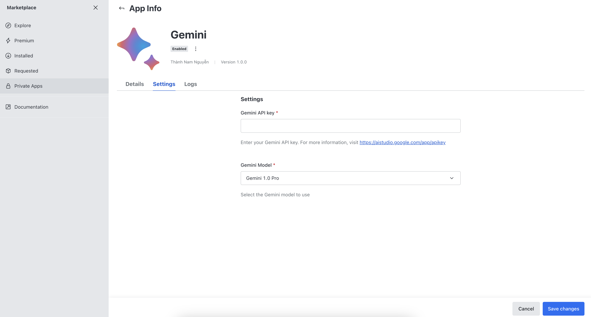
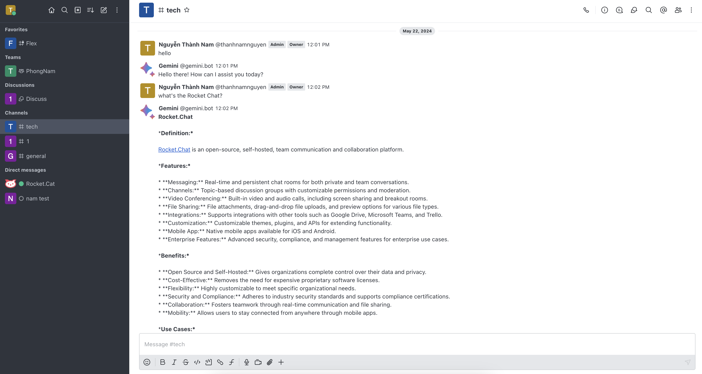
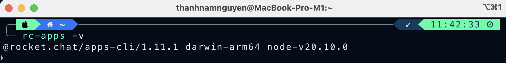

<div align="center">
    <h1 align="center">Rocket.Chat.App-Gemini</h1>
    
    <br />
    <br />
    <p>Google AI - Gemini integration for Rocket.Chat</p>
</div>

## Install bot

**Step 1:** Clone this repository

**Step 2:** Click three dot in left sidebar -> App (Marketplace) -> Private Apps -> Upload a private app -> Choose file `gemini_1.0.0.zip` (in `dist` folder) -> Install


**Step 3:** Click tab setting, fill `API Key` (get from [AI Studio Google](https://aistudio.google.com/app/apikey)) and choose `GEMINI MODEL` -> Save



**Step 4:** Go to channel, type `/gemini <prompt>`



## Development

1. Copy this folder to your Rocket.Chat App folder (in root folder of Rocket.Chat)
2. Check `Rocket.Chat Apps-Engine CLI` installed

```bash
rc-apps -v
```



If you don't have `Rocket.Chat Apps-Engine CLI`, install it

```bash
npm install -g @rocket.chat/apps-cli
```

**Error:** While attempting to execute the preceding command, if your operating system rejects the operation, it is likely that you do not have permission to access the file as the current user. If you suspect a permissions issue, please double-check your NPM installation, or rerun the command as root/Administrator.

**Resolution:** Prefix the command with sudo and execute as follows:

```bash
sudo npm install -g @rocket.chat/apps-cli
```

Next, install the Apps-Engine framework/library which allows applications to recognize Apps-Engine. To do this, open the terminal in Visual Studio and execute the following command:

```bash
npm install
```

Refer docs: [Create an App](https://developer.rocket.chat/apps-engine/creating-an-app)

You are now all set to develop your app. You can develop `gemini-bot` and run `rc-apps package` to package the app for distribution, and re-install or override package it in Private Apps.

## 🤝 Contributing

Contributions, issues and feature requests are welcome.

Feel free to check [issues page](https://github.com/namnguyenthanhwork/Rocket.Chat.App-Gemini/issues) if you want to contribute.

## ❤ Show your support

Please ⭐️ this repository if this project helped you!

## Related projects Rocket.Chat

- [Rocket.Chat.App-ChatGPT](https://github.com/namnguyenthanhwork/Rocket.Chat.App-ChatGPT)
- [Rocket.Chat.App-Wikipedia](https://github.com/namnguyenthanhwork/Rocket.Chat.App-Wikipedia)
